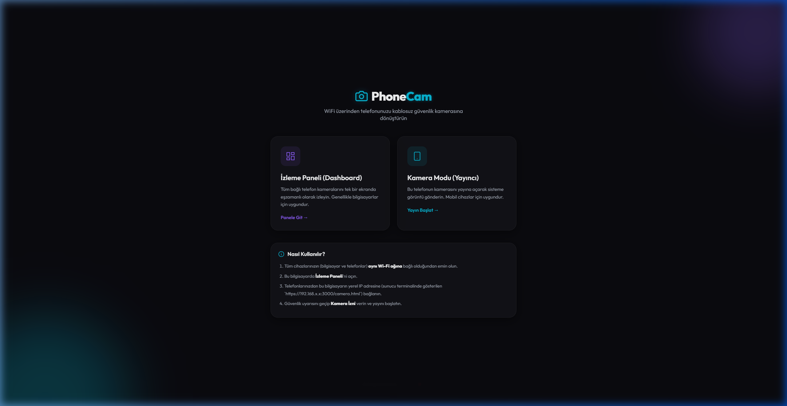
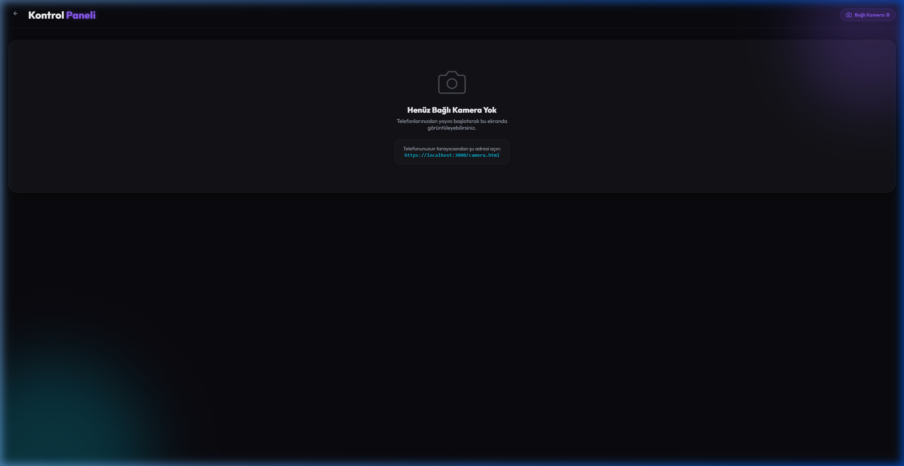
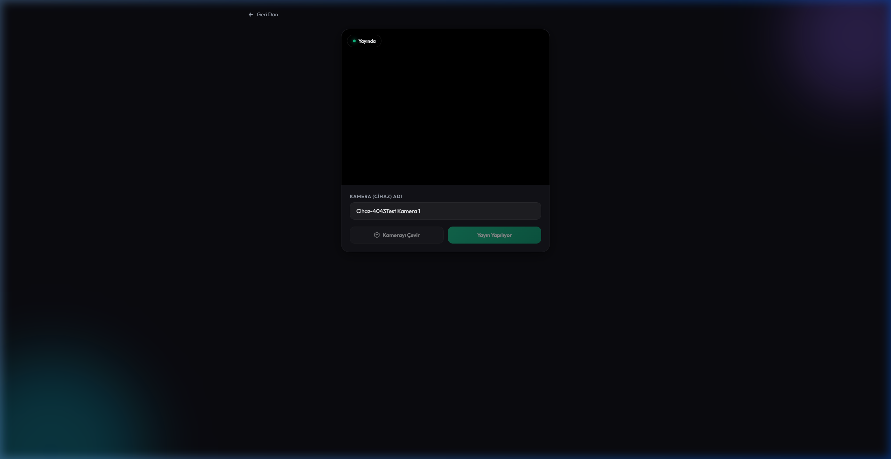
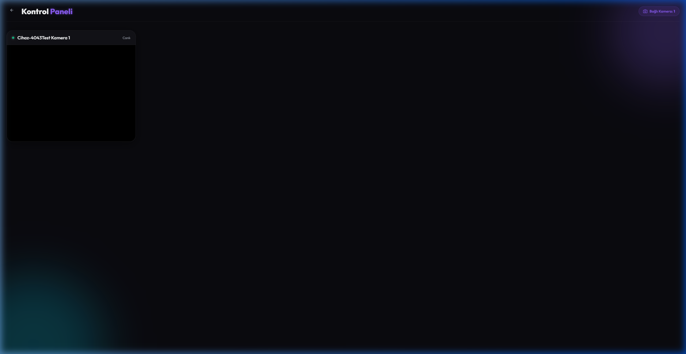

# PhoneCam

🇹🇷 [Türkçe Sürüm için Tıklayın](#türkçe-sürüm) | 🇬🇧 [Click for English Version](#english-version)

---

## 📸 Ekran Görüntüleri & Demo / Screenshots & Demo

<p align="center">
  
  
</p>
<p align="center">
  
  
</p>

---

## Türkçe Sürüm

PhoneCam, evinizdeki veya ofisinizdeki eski/aktif akıllı telefonları kablosuz birer güvenlik kamerasına dönüştüren, yerel Wi-Fi ağınız üzerinden çalışan **WebRTC** tabanlı gerçek zamanlı bir web uygulamasıdır.

Görüntüler doğrudan cihazlar arasında (Peer-to-Peer) aktarıldığı için sıfıra yakın gecikme (ultra-low latency) ve yüksek performans sunar.

### 🚀 Öne Çıkan Özellikler

* **Çoklu Kamera Desteği**: Tek bir kontrol panelinden (Dashboard) dilediğiniz kadar telefonu bağlayıp grid (ızgara) şeklinde eşzamanlı izleyin.
* **WebRTC & WebSocket Teknolojisi**: Görüntüler sunucu üzerinden geçmez, doğrudan telefondan bilgisayara akar. Yerel ağ hızınızda ve tamamen güvenlidir.
* **Modern & Premium Arayüz**: Koyu mod (dark mode) ve cam morfizmi (glassmorphism) tasarımı ile şık arayüz.
* **Ekran Kilidi Önleyici (Screen Wake Lock)**: Telefon yayın yaparken ekranının kararıp kapanmasını (uyku modunu) engeller.
* **Kesintisiz Yayın (No Timeout)**: Sunucu soket zaman aşımları kaldırılmıştır, 7/24 kesintisiz çalışabilir.
* **Kamera Değiştirme**: Telefon yayın ekranından ön ve arka kameralar arasında anlık geçiş yapabilme imkanı.
* **Dinamik Bağlantı Bilgisi**: Giriş sayfasında ve kontrol panelinde, telefonların tarayıcıdan girmesi gereken güncel yerel IP adreslerini dinamik olarak listeler.

### 🛠️ Teknolojiler

* **Backend**: Node.js, Express, Socket.io (Sinyalleşme/Signaling için)
* **SSL**: `selfsigned` kütüphanesi (Çalışma anında geçici HTTPS sertifikası üretimi)
* **Frontend**: HTML5, Vanilla CSS, WebRTC (`RTCPeerConnection`), Screen Wake Lock API

### 📦 Kurulum ve Çalıştırma

#### Gereksinimler
* Bilgisayarınızda **Node.js** yüklü olmalıdır.
* Bilgisayarınız ve telefonlarınız **aynı Wi-Fi ağına** bağlı olmalıdır.

#### Adımlar

1. **Bağımlılıkları Kurun**:
   ```bash
   npm install
   ```

2. **Sunucuyu Başlatın**:
   ```bash
   npm start
   ```

3. **Adresleri Not Edin**:
   Sunucu başladığında konsolda yerel IP adresleriniz yazacaktır:
   ```
   Bilgisayardan izlemek için: https://localhost:3000/dashboard.html
   Telefondan bağlanmak için: https://[IP-ADRESINIZ]:3000/camera.html
   ```

### 🖥️ Kullanım Rehberi

> [!IMPORTANT]
> **HTTPS ve Güvenlik Sertifikası Uyarısı**
> Mobil tarayıcılar kamera erişimini sadece HTTPS bağlantılarında verir. Sunucu **kendinden imzalı (self-signed) SSL sertifikası** ürettiği için tarayıcı "Güvenli değil" uyarısı verecektir.
> 
> * **Ne yapmalısınız?** Sayfaları ilk açtığınızda çıkan uyarıyı geçmek için **"Gelişmiş" -> "Devam et / İlerle (güvenli değil)"** seçeneğini seçin. Bu yerel ağınızda tamamen güvenlidir.

1. Bilgisayarınızdan `https://localhost:3000/dashboard.html` adresine gidin.
2. Telefonunuzdan terminalde veya kontrol panelinde yazan yerel IP adresini açın (örn: `https://192.168.1.109:3000/camera.html`).
3. Kamera iznini onaylayın, cihaza bir isim verin ve **"Yayını Başlat"** butonuna dokunun.

---

## English Version

PhoneCam is a **WebRTC-based** real-time web application running over your local Wi-Fi network that turns your old or active smartphones into wireless security cameras.

Streams are transmitted directly between devices (Peer-to-Peer), offering near-zero latency and high performance.

### 🚀 Key Features

* **Multi-Camera Support**: Connect as many phones as you want and monitor them simultaneously in a grid layout on a single dashboard.
* **WebRTC & WebSocket Tech**: Media streams flow directly from phones to your computer without passing through the server, ensuring local network speed and security.
* **Modern & Premium UI**: Sleek user experience styled with dark mode and glassmorphism.
* **Screen Wake Lock**: Automatically prevents the phone screen from dimming or sleeping while broadcasting.
* **Continuous Streaming (No Timeout)**: Server-side socket timeouts are disabled to allow stable 24/7 streaming.
* **Camera Toggling**: Switch between the front and rear cameras on the fly from the phone screen.
* **Dynamic Connection Info**: Displays the correct local IP URLs dynamically on the landing page and dashboard empty state so you don't need to check the terminal.

### 🛠️ Tech Stack

* **Backend**: Node.js, Express, Socket.io (for WebRTC Signaling)
* **SSL**: `selfsigned` library (generates a temporary HTTPS certificate on startup)
* **Frontend**: HTML5, Vanilla CSS, WebRTC (`RTCPeerConnection`), Screen Wake Lock API

### 📦 Installation & Setup

#### Prerequisites
* **Node.js** must be installed on your computer.
* Your PC and streaming phones must be connected to the **same Wi-Fi network**.

#### Steps

1. **Install Dependencies**:
   ```bash
   npm install
   ```

2. **Start the Server**:
   ```bash
   npm start
   ```

3. **Get Connection Links**:
   When the server starts, it prints the local IPs in the terminal:
   ```
   PC Dashboard URL: https://localhost:3000/dashboard.html
   Mobile Camera URL: https://[YOUR-IP]:3000/camera.html
   ```

### 🖥️ User Guide

> [!IMPORTANT]
> **HTTPS and SSL Certificate Warning**
> Mobile browsers require HTTPS to grant camera permissions. Since the server runs on a **self-signed SSL certificate**, browsers will trigger a privacy warning.
> 
> * **What to do?** Click **"Advanced" -> "Proceed to ... (unsafe)"** to bypass the warning. This is perfectly safe for local network setups and is required for the camera to work.

1. Open `https://localhost:3000/dashboard.html` on your PC.
2. Open the local IP address on your phone (e.g. `https://192.168.1.109:3000/camera.html`).
3. Approve camera permissions, choose a device name, and tap **"Yayını Başlat" (Start Broadcast)**.

---

## 📂 Dizin Yapısı / Folder Structure

```
phonecam/
├── package.json         # Proje bağımlılık tanımları / Dependencies
├── server.js            # Node.js HTTPS sunucusu / Server and signaling
├── README.md            # Kullanım dokümanı / Documentation
└── public/              # İstemci dosyaları / Client assets
    ├── index.html       # Karşılama ekranı / Landing page
    ├── camera.html      # Telefon yayın arayüzü / Phone camera client
    ├── dashboard.html   # Bilgisayar izleme paneli / Dashboard visualizer
    ├── css/
    │   └── style.css    # Modern CSS stili / Common stylesheet
    └── js/
        ├── camera.js    # Telefon yayın kodları / Camera WebRTC logic
        └── dashboard.js # Alıcı panel kodları / Dashboard WebRTC logic
```
